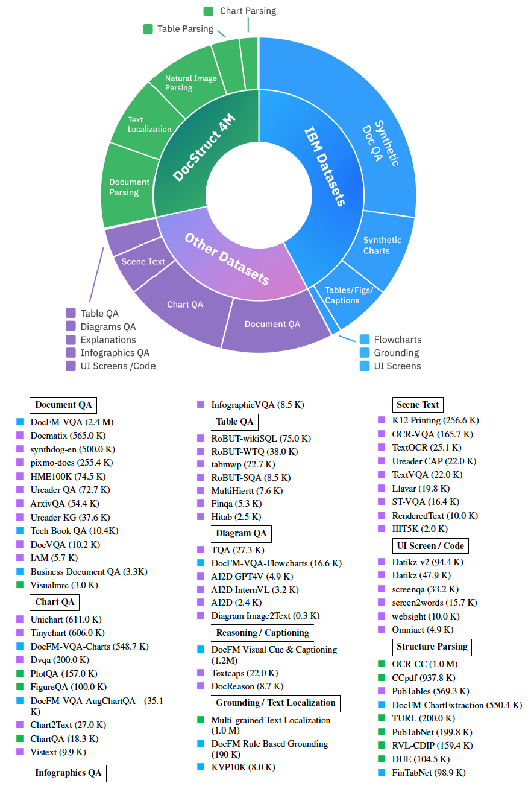
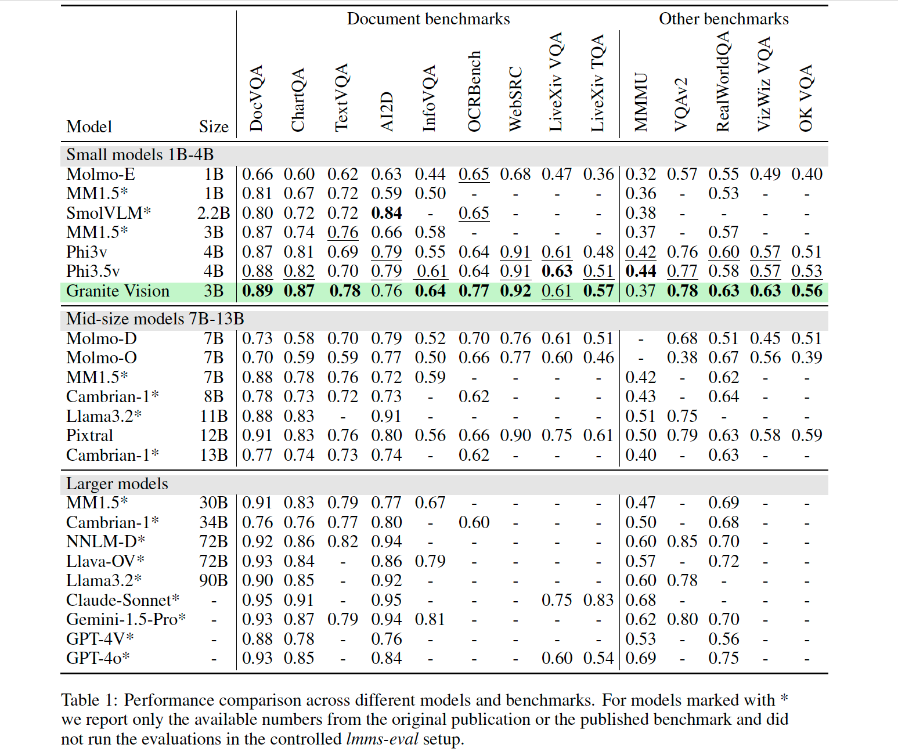

<p align="center">
  
</p>

<p align="center">
  :books: <a href="https://arxiv.org/abs/2502.09927">Paper</a>&nbsp | :hugs: <a href="https://huggingface.co/collections/ibm-granite/granite-vision-models-67b3bd4ff90c915ba4cd2800">HuggingFace Collection</a>&nbsp | 
  :speech_balloon: <a href="https://github.com/orgs/ibm-granite/discussions">Discussions Page</a>&nbsp
<br>
  
---
## Introduction to Granite Vision Models

We introduce Granite Vision, a lightweight large language model with vision capabilities, specifically designed to excel in enterprise use cases, particularly in visual document understanding. Our model is trained on a comprehensive instruction-following dataset, including document-related tasks, such as content extraction from tables, charts, diagrams, sketches, and infographics, as well as general image tasks. The architecture of Granite Vision is centered around visual modality alignment with a decoder-only, 2 billion parameter Granite large language model. Additionally, we introduce a dedicated safety classification approach in test-time that leverages a sparse set of attention vectors to identify potential harmful inputs. Despite its lightweight architecture, Granite Vision achieves strong results in standard benchmarks related to visual document understanding, as well as on the LiveXiv benchmark, which is designed to avoid test set contamination by using a constantly updated corpus of recently published Arxiv papers. We are releasing the model under the [Apache-2.0 license](https://www.apache.org/licenses/LICENSE-2.0), allowing for both research and commercial use, while offering complete visibility into the training data and other relevant details.

## Comprehensive Multimodal Data 

Granite Vision has been trained on a comprehensive instruction-following dataset, which covers a wide variety of visual categories ranging from document images to general images. The training data consists of a combination of pre-curated public vision datasets, common-crawl PDFs, and data that is synthesized in-house. A detailed view of our data is presented in Figure 1, which depicts document understanding
datasets, and Figure 2, which represents general image datasets. 
<figure>
  
  <figcaption>
  Figure 1. Overview of our comprehensive collection of document understanding datasets used for Granite Vision training.</figcaption>
</figure>
</br>

<figure>
  
  <figcaption>
  Figure 2. Overview of general image datasets used for Granite Vision training.</figcaption>
</figure>
</br>

## Evaluations Results

We evaluated Granite Vision 3.2 model alongside other vision-language models (VLMs) using the standard llms-eval benchmark. The evaluation spanned multiple public benchmarks, with particular emphasis on document understanding tasks while also including general visual question-answering benchmarks. 

<figure>
  
</figure>
</br>


## How to Use our Model?
Currently the model supports English instructions and images (png and jpeg) as input format.
To use our model, set `model_path` to:
1. `ibm-granite/granite-vision-3.2-2b`

### Usage with `transformers`

First, make sure to build the latest verions of transormers:
```shell
pip install transformers>=4.49
```

Then run the code:
```python
from transformers import AutoProcessor, AutoModelForVision2Seq
from huggingface_hub import hf_hub_download
import torch

device = "cuda" if torch.cuda.is_available() else "cpu"

model_path = "ibm-granite/granite-vision-3.2-2b"
processor = AutoProcessor.from_pretrained(model_path)
model = AutoModelForVision2Seq.from_pretrained(model_path).to(device)

# prepare image and text prompt, using the appropriate prompt template

img_path = hf_hub_download(repo_id=model_path, filename='example.png')

conversation = [
    {
        "role": "user",
        "content": [
            {"type": "image", "url": img_path},
            {"type": "text", "text": "What is the highest scoring model on ChartQA and what is its score?"},
        ],
    },
]
inputs = processor.apply_chat_template(
    conversation,
    add_generation_prompt=True,
    tokenize=True,
    return_dict=True,
    return_tensors="pt"
).to(device)


# autoregressively complete prompt
output = model.generate(**inputs, max_new_tokens=100)
print(processor.decode(output[0], skip_special_tokens=True))
```

### Usage with vLLM

The model can also be loaded with `vLLM`. First make sure to install the following libraries:

```shell
pip install torch torchvision torchaudio
pip install vllm==0.6.6
```
Then, copy the snippet from the section that is relevant for your use case.

```python
from vllm import LLM, SamplingParams
from vllm.assets.image import ImageAsset
from huggingface_hub import hf_hub_download
from PIL import Image

model_path = "ibm-granite/granite-vision-3.2-2b"

model = LLM(
    model=model_path,
    limit_mm_per_prompt={"image": 1},
)

sampling_params = SamplingParams(
    temperature=0.2,
    max_tokens=64,
)

# Define the question we want to answer and format the prompt
image_token = "<image>"
system_prompt = "<|system|>\nA chat between a curious user and an artificial intelligence assistant. The assistant gives helpful, detailed, and polite answers to the user's questions.\n"

question = "What is the highest scoring model on ChartQA and what is its score?"
prompt = f"{system_prompt}<|user|>\n{image_token}\n{question}\n<|assistant|>\n"
img_path = hf_hub_download(repo_id=model_path, filename='example.png')
image = Image.open(img_path).convert("RGB")
print(image)

# Build the inputs to vLLM; the image is passed as `multi_modal_data`.
inputs = {
    "prompt": prompt,
    "multi_modal_data": {
        "image": image,
    }
}

outputs = model.generate(inputs, sampling_params=sampling_params)
print(f"Generated text: {outputs[0].outputs[0].text}")
```

### Fine-tuning

For an example of fine-tuning Granite Vision for new tasks refer to [this notebook](https://huggingface.co/learn/cookbook/en/fine_tuning_granite_vision_sft_trl).

### Use Granite Vision for MM RAG

For an example of MM RAG using granite vision refer to [this notebook](https://github.com/ibm-granite-community/granite-snack-cookbook/blob/main/recipes/RAG/Granite_Multimodal_RAG.ipynb).

## How to Download our Model?
The model of choice (granite-vision-3.2-2b in this example) can be cloned using:
```shell
git clone https://huggingface.co/ibm-granite/granite-vision-3.2-2b
```

## How to Contribute to this Project?
Plese check our [Guidelines](/CONTRIBUTING.md) and [Code of Conduct](/CODE_OF_CONDUCT.md) to contribute to our project.

## Model Cards
The Granite Vision model is available on HuggingFace. Please visit our collection [here](https://huggingface.co/collections/ibm-granite/granite-vision-models-67b3bd4ff90c915ba4cd2800).

## License 
All Granite Vision Models are distributed under [Apache 2.0](./LICENSE) license.

## Would you like to provide feedback?
Please let us know your comments about our family of language models by visiting our [collection](https://huggingface.co/collections/ibm-granite/granite-vision-models-67b3bd4ff90c915ba4cd2800). Select the repository of the model you would like to provide feedback about. Then, go to *Community* tab, and click on *New discussion*. Alternatively, you can also post any questions/comments on our [github discussions page](https://github.com/orgs/ibm-granite/discussions).

## Ethical Considerations and Limitations
The use of Large Vision and Language Models involves risks and ethical considerations people must be aware of, including but not limited to: bias and fairness, misinformation, and autonomous decision-making. Granite-vision-3.2-2b is not the exception in this regard. Although our alignment processes include safety considerations, the model may in some cases produce inaccurate, biased, or unsafe responses to user prompts.
Additionally, it remains uncertain whether smaller models might exhibit increased susceptibility to hallucination in generation scenarios due to their reduced sizes, which could limit their ability to generate coherent and contextually accurate responses.
This aspect is currently an active area of research, and we anticipate more rigorous exploration, comprehension, and mitigations in this domain. Regarding ethics, a latent risk associated with all Large Language Models is their malicious utilization. We urge the community to use granite-vision-3.2-2b with ethical intentions and in a responsible way. We recommend using this model for document understanding tasks, and note that more general vision tasks may pose higher inherent risks of triggering biased or harmful output.
To enhance safety, we recommend using granite-vision-3.2-2b alongside Granite Guardian. Granite Guardian is a fine-tuned instruct model designed to detect and flag risks in prompts and responses across key dimensions outlined in the IBM AI Risk Atlas. Its training, which includes both human-annotated and synthetic data informed by internal red-teaming, enables it to outperform similar open-source models on standard benchmarks, providing an additional layer of safety. 

<!-- ## Citation
If you find granite models useful, please cite:

```
@misc{ranitevisionteam2025granitevisionlightweightopensource,
  title={Granite Vision: a lightweight, open-source multimodal model for enterprise Intelligence},
  url={},
  author={Granite Vision Team, IBM},
      year={2025},
      eprint={2502.09927},
      archivePrefix={arXiv},
      primaryClass={cs.CV},
      url={https://arxiv.org/abs/2502.09927}, 
}
``` -->
